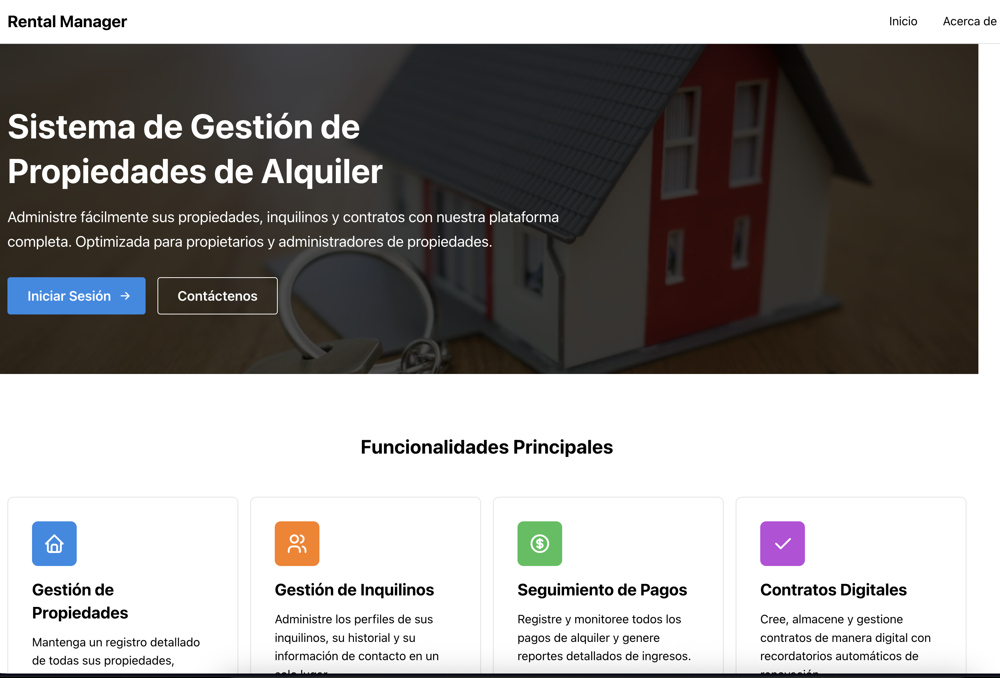
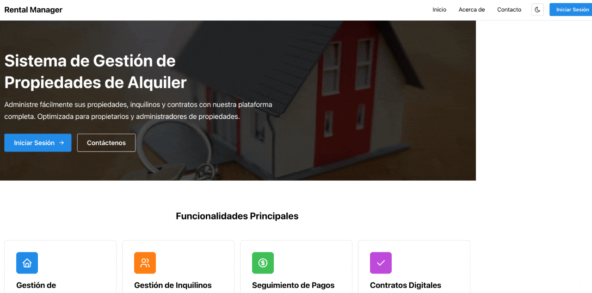

# Rental Management Application

A full-stack rental property management application with React frontend and Go backend, using Supabase as the database.

## 🚀 Live Demo

**Frontend**: [https://nescool101.github.io/rentalTracker/](https://nescool101.github.io/rentalTracker/)
**Backend**: [https://rentalfullnescao.fly.dev](https://rentalfullnescao.fly.dev)

### Screenshots



*Sistema de Gestión de Propiedades de Alquiler - Main landing page showing the comprehensive rental management platform*



*Live demonstration of the application features and navigation*

## Features

- Modern React frontend with Vite and TypeScript
- Progressive Web App (PWA) capabilities for offline access
- Go backend with RESTful API endpoints
- Supabase integration for secure data storage
- Comprehensive property and tenant management
- **GitHub Pages deployment** for frontend
- **Fly.io deployment** for backend
- **Feature flags** for optional integrations (Telegram backup)

## Running with Docker Compose

1. Make sure you have Docker and Docker Compose installed on your system.

2. Clone this repository:
   ```
   git clone https://github.com/nescool101/rentalTracker.git
   cd rentalTracker
   ```

3. Start the application:
   ```
   docker-compose up
   ```

4. Access the application:
   - Frontend: http://localhost
   - Backend API: http://localhost:8081

## Development

### Frontend

The frontend is a React application with Vite and TypeScript located in the `frontend` directory.

To run the frontend locally (outside Docker):
```
cd frontend
npm install
npm run dev
```

### Backend

The backend is a Go application located in the `backend` directory.

To run the backend locally (outside Docker):
```
cd backend
go mod download
go run main.go
```

## API Endpoints

### Legacy Endpoints
- `GET /payers` - Get all payers
- `GET /validate_email` - Trigger email validation

### RESTful API Endpoints
- `GET /api/persons` - Get all persons
- `GET /api/persons/:id` - Get person by ID
- `POST /api/persons` - Create a new person
- `PUT /api/persons/:id` - Update a person
- `DELETE /api/persons/:id` - Delete a person

- `GET /api/properties` - Get all properties
- `GET /api/properties/:id` - Get property by ID
- `POST /api/properties` - Create a new property
- `PUT /api/properties/:id` - Update a property
- `DELETE /api/properties/:id` - Delete a property

- `GET /api/rentals` - Get all rentals
- `GET /api/rentals/:id` - Get rental by ID
- `POST /api/rentals` - Create a new rental
- `PUT /api/rentals/:id` - Update a rental
- `DELETE /api/rentals/:id` - Delete a rental

### Contract API Endpoints
- `POST /api/contracts/generate` - Generate a contract PDF 
- `POST /api/contract-signing/request` - Request a signature for a contract
- `GET /api/contract-signing/status/:id` - Get status of a signature request
- `POST /api/contract-signing/sign/:id` - Sign a contract
- `POST /api/contract-signing/reject/:id` - Reject a contract signing request

## Database Schema

### Contract Signatures Table
```sql
CREATE TABLE IF NOT EXISTS contract_signatures (
  id UUID PRIMARY KEY,
  contract_id UUID NOT NULL,
  recipient_id UUID NOT NULL,
  recipient_email TEXT NOT NULL,
  status TEXT NOT NULL,
  created_at TIMESTAMP WITH TIME ZONE NOT NULL,
  expires_at TIMESTAMP WITH TIME ZONE NOT NULL,
  signed_at TIMESTAMP WITH TIME ZONE,
  rejected_at TIMESTAMP WITH TIME ZONE,
  signature_data BYTEA,
  pdf_path TEXT,
  signed_pdf_path TEXT
);

CREATE INDEX IF NOT EXISTS idx_contract_signatures_contract_id ON contract_signatures(contract_id);
CREATE INDEX IF NOT EXISTS idx_contract_signatures_recipient_id ON contract_signatures(recipient_id);
CREATE INDEX IF NOT EXISTS idx_contract_signatures_status ON contract_signatures(status);
```

## License

See the [LICENSE](LICENSE) file for details.